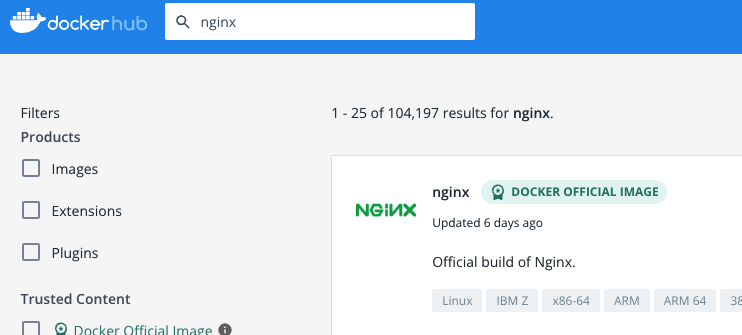
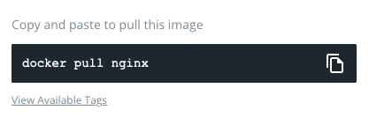

# Docker pull
Docker에서 image를 pull 하는 방법

## dockerhub에서 원하는 이미지 다운로드

### dockerhub 접속
- [https://hub.docker.com](https://hub.docker.com/)
- 접속 후 우측 상단 Explore 클릭
	- 들어가보면 인기있는 이미지 목록이 나열되어 있다.

### 원하는 이미지 검색
- 예를 들어 nginx가 구축되어있는 이미지를 원한다면 nginx를 검색해본다.
	- 이미지 이름 옆에 DOCKER OFFICIAL IMAGE라고 적혀있다면, 도커에서 공식적으로 관리하는 믿을수 있는 이미지라는 뜻이다.

- 이미지를 클릭하여 들어가보면 로컬에서 이미지를 pull 할 수 있는 커맨드가 나와있다.
	- 그 외 이미지 pull에 관한 다른 커맨드를 알고싶다면 [공식문서](https://docs.docker.com/engine/reference/commandline/pull/)를 참조하면 된다.

