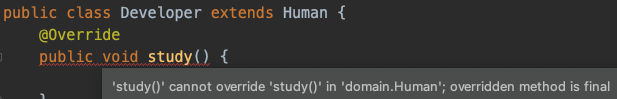

# final 키워드
Java에서 final 키워드의 의미를 알아본다.

## final 키워드의 의미
- Java에서 final 키워드는 변수, 메소드, 클래스에 붙을 수 있다. 
	- 변수에 붙을 시: 해당 변수는 값이 한번 할당되면 더 이상 변경될 수 없다.
	- 메소드에 붙을 시: 해당 메소드는 재정의(overriding)될 수 없다.
	- 클래스에 붙을 시: 해당 클래스를 다른 클래스에서 상속할 수 없다.

### 변수에 붙는 final
- 한번 값이 할당되면 수정할 수 없다.
- 더이상 변경될 필요가 없거나 변경되서는 안될 값을 할당할때 사용한다.
- primitive type뿐만 아니라 reference type에도 적용 가능하다.

`primitive type`


`reference type`


### 메소드에 붙는 final
- 해당 메소드를 재정의할 수 없게 된다.

```java
public class Human {
    final void study() { // 자식 클래스에서 study()를 재정의 할 수 없다.
        System.out.println("공부한다.");
    }
}
```



### 클래스에 붙는 final
- 해당 클래스를 다른 클래스에서 상속할 수 없다.

```java
public final class Human {
    ...   
}
```


