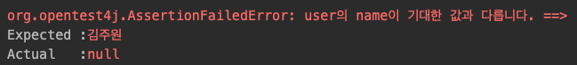

# Assertion
Assertion에 대해 알아본다.

## Assertion이란
- 테스트에서 검증하고자 하는 내용을 확인하는 기능이다.
- org.junit.jupiter.api.Assertions 클래스에서 제공한다.

## Assertion의 대표적인 기능
1. assertEquals(expected, actual)
	- 기대한 값이 실제 값과 같은지 확인
2. assertNotNull(actual)
	- 값이 null이 아닌지 확인
3. assertTrue(boolean)
	- 조건이 true인지 확인
4. assertAll(executables...)
	- 모든 검증 구문 확인
5. assertThrows(expectedType, executable)
	- 예외 발생 확인
6. assertTimeout(duration, executable)
	- 시간 안에 실행이 완료되는지 확인

### 1. assertEquals(expected, actual)
- 기대한 값이 실제 값과 같은지 확인한다.

```java
@Test
void test2() {
    ...
    ...
        
    assertEquals("김주원", user.getName());
}
```

- 객체 비교의 경우 **동등성 비교(equals)**한다.
	- 동일성 비교(==)와 다르다. 
- 인자의 순서는 api 명세대로 기대되어지는값(expected), 실제값(actual)이 추천된다.
	- 순서가 바뀌어도 테스트에 문제는 없으나, api 의도에 맞춰 넣어주는 것이 바람직하다.
- 세번째 인자에 메시지를 넣을 수 있다. (메소드 오버로딩)
	- 테스트에 실패했을 시 나타나는 메시지 (String)

```java
@Test
void test() {
    ...
    ...
        
    assertEquals("김주원", user.getName(), "user의 name이 기대한 값과 다릅니다.");
}
```


- 테스트에 실패했을 시 나타나는 메시지는 그냥 문자열을 넣어주는 것보다 supplier functional interface의 익명 객체를 생성(람다식)하는 것이 성능에 더 좋다.
	- 그냥 문자열만 넣으면: 테스트 실패 여부와 상관 없이 문자열 생성 연산을 한다.
	- supplier funtional interface 익명 객체를 넣으면: 테스트가 실패해야 문자열 생성 연산을 한다.
		- 람다식으로 깔끔하게 표현 가능하다.
	- 만약 문자열 연산 비용이 걱정이 되는 수준이라면 supplier funtional interface 익명 객체를 쓰면 된다.

```java
assertEquals("김주원", user.getName(), () -> "user의 name이 기대한 값과 다릅니다.");
```
			
### 2. assertNotNull(actual)
- 인자로 들어온 값이 null이 아닌지 확인한다.
- 마찬가지로 다음 인자에 String 타입 메시지나 Supplier<String> functional interface 익명 객체를 넣을 수 있다. (오버로딩)

### 3. assertTrue(boolean)
- 인자로 들어온 조건이 true인지 확인한다.
- 마찬가지로 다음 인자에 String 타입 메시지나 Supplier<String> functional interface 익명 객체를 넣을 수 있다. (오버로딩)

### 4. assertAll(executables...)
- 하나의 테스트 메소드 안에 2개 이상의 Assert 기능을 사용할 경우, 각 검증 구문에 대해 모두 테스트를 진행하는 기능이다.
- AssertAll을 사용하지 않는다면 하나의 검증 구문이 테스트를 실패했을때 다음 검증 구문을 실행하지 않는다.

```java
@Test
void test() {
    ...
    ...
    
    // assertEquals 테스트가 실패할경우 assertTrue 테스트가 진행되지 않아 assertTrue에 대한 테스트 결과를 모른다. 
    assertEquals("박주원", user.getName());
    assertTrue(user.getAge() < 23);
}
```

만약 다음과 같이 assertAll()을 사용한다면 모든 테스트가 진행된다.

```java
@Test
void test() {
    ...
    ...
    
    // assertEquals 테스트가 실패할경우 assertTrue 테스트가 진행되지 않아 assertTrue에 대한 테스트 결과를 모른다. 
    assertAll(
            () -> assertEquals("박주원", user.getName()),
            () -> assertTrue(user.getAge() < 22)
    );
}
```

더 자세히 말하자면 junit에서 제공하는 Executable functional interface 익명 객체를 assertAll 안에 나열한 구조이다. 인자와 반환값이 없는 구조이며, 람다식으로 깔끔하게 작성 가능하다.

### 5. assertThrows(expectedType, executable)
- 첫번째 인자로 넣은 Exception type이, 두번째 인자로 넣은 코드에서 throw 되는지 확인한다.
- 두번째 인자는 Executable 타입 익명 객체이다.
	- 람다식으로 표현 가능하다.
	
```java
@Test
void test() {
    User user = null;

    // null인 객체에서 메소드를 호출하므로 NullPointerException이 발생하므로 테스트 통과
    assertThrows(NullPointerException.class, () -> user.method());
}
```

- throw된 exception 객체를 리턴하기 때문에 받아서 사용 가능하다.

```java
NullPointerException exception = assertThrows(NullPointerException.class, 
                () -> user.method());
```

### 6. assertTimeout(duration, executable)
- 코드가 특정 시간 안에 수행되는지 확인한다.
- 두번째 인자로 들어온 실행 코드가 첫번째 인자로 들어온 시간이 지나기 전에 완료되면 테스트 성공, 아니라면 실패된다.
	- 첫번째 인자는 java.time.Duration의 메소드를 사용한다.
	- 두번째 인자는 Executable 타입의 익명 객체이다.
		- 인자와 반환값이 없고 람다식으로 깔끔하게 작성 가능하다.

```java
@Test
void test() {
    assertTimeout(Duration.ofMillis(100), () -> Thread.sleep(800)); // 테스트 실패
}
```

- 기본적으로 두번째 인자로 들어온 코드의 수행 시간이 끝나야 테스트가 종료된다.
	- 실패하는 테스트의 경우에서, 기준 시간이 지났음에도 계속 코드가 실행되는 것은 비효율적이다.
	- 만약 첫번째 인자로 들어온 시간이 끝나자마자 그 즉시 테스트 실패를 띄우고 싶다면 assertTimeoutPreemptively() 메소드를 사용한다.

```java
@Test
void test() {
    // 100 밀리초가 지나자마자 테스트가 실패로 종료된다.
    assertTimeoutPreemptively(Duration.ofMillis(100), () -> Thread.sleep(800));
}
```