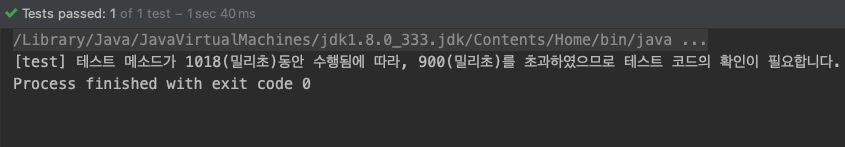

# Junit 5 확장 모델
테스트 메소드와 관련하여 추가 기능을 넣을 수 있는 JUnit 5 확장 모델에 대해 알아본다.

## 확장 모델 만드는 방법
설명할 요소들은 전부 org.junit.jupiter.api.extension에 정의되어 있다.

1. BeforeTestExecutionCallback, AfterTestExecitionCallback를 implements 하는 클래스 생성
	- BeforeTestExecutionCallback interface는 `beforeTestExecution()`을 구현해야 한다.
		- 테스트 메소드가 실행되기 전에 실행된다.
	- AfterTestExecutionCallback interface는 `afterTestExecution()`을 구현해야 한다.
		- 테스트 메소드가 실행된 후에 실행된다.

2. 각각의 메소드에는 매개변수로 ExtensionContext 타입 변수 선언
	- ExtensionContext는 인터페이스로, 테스트에 관한 각종 정보들을 얻는 메소드가 선언되어 있다.
3. 넣을 기능에 대한 코드를 작성한다.

## Store
- Store라는 개념이 있다.
- Extension의 실행동안 값이나 객체를 보관하고 필요시 조회할 수 있다.
- namespace를 설정하여야 한다.

```java
// time 이라는 namespace의 Store 생성
ExtensionContext.Store store = context.getStore(ExtensionContext.Namespace.create("example_namespace"));

// 객체를 넣거나 조회할 수 있다.
store.put("name", "juwon");
System.out.println(store.get("name"));
```

## 확장 모델 등록 방법
- 선언적인 등록: @ExtendWith

```java
@ExtendWith(TimeExcessCheckExtension.class)
public class MyTest {
    ...
}
```

- 프로그래밍 등록: @RegisterExtension


- 자동 등록 자바 [ServiceLoader](https://docs.oracle.com/en/java/javase/11/docs/api/java.base/java/util/ServiceLoader.html) 이용

## 예시
테스트 메소드의 실행 시간이 특정 시간을 초과하면 경고 메시지를 출력하는 확장 기능

- @TimeExcessCheck 어노테이션(내가 만든 커스텀 어노테이션)이 선언된 메소드에 적용
	- value 속성 값으로 양의 정수(밀리초)를 넣어준다.
	- 테스트 실행 시간이 value 속성 값을 초과하면 경고 메시지 출력

```java:TimeExcessCheckExtension.java
import com.kimjuwon.junit5study.annotation.TimeExcessCheck;
import org.junit.jupiter.api.extension.*;

public class TimeExcessCheckExtension implements BeforeTestExecutionCallback, AfterTestExecutionCallback {
    @Override
    public void beforeTestExecution(ExtensionContext context) throws Exception {
        if (hasTimeExcessCheckAnnotation(context)) {
            ExtensionContext.Store store = context.getStore(ExtensionContext.Namespace.create("time"));
            store.put("startTime", System.currentTimeMillis());
        }
    }

    @Override
    public void afterTestExecution(ExtensionContext context) throws Exception {
        if (hasTimeExcessCheckAnnotation(context)) {
            ExtensionContext.Store store = context.getStore(ExtensionContext.Namespace.create("time"));

            long endTime = System.currentTimeMillis();
            long startTime = (long) store.get("startTime");
            long time = endTime - startTime;
            long excessCheckTime = getTimeExcessCheckAnnotationValue(context);
            String methodName = context.getRequiredTestMethod().getName();

            if (time > excessCheckTime) {
                System.out.printf("[%s] 테스트 메소드가 %d(밀리초)동안 수행됨에 따라, %d(밀리초)를 초과하였으므로 테스트 코드의 확인이 필요합니다.",
                        methodName, time, excessCheckTime);
            }
        }
    }

    private boolean hasTimeExcessCheckAnnotation(ExtensionContext context) {
        TimeExcessCheck annotation = context.getRequiredTestMethod()
                .getAnnotation(TimeExcessCheck.class);

        return annotation != null;
    }

    private long getTimeExcessCheckAnnotationValue(ExtensionContext context) {
        return context.getRequiredTestMethod().
                getAnnotation(TimeExcessCheck.class).value();
    }
}
```

```java:MyTest.java
import com.kimjuwon.junit5study.Extension.TimeExcessCheckExtension;
import com.kimjuwon.junit5study.annotation.TimeExcessCheck;
import org.junit.jupiter.api.*;
import org.junit.jupiter.api.extension.RegisterExtension;

class MyTest {
    @RegisterExtension
    static TimeExcessCheckExtension timeExcessCheckExtension = new TimeExcessCheckExtension();

    @Test
    @TimeExcessCheck(900)
    void test() throws InterruptedException {
        Thread.sleep(1000);
    }
}
```

