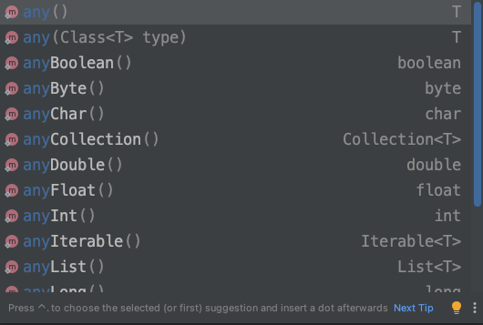

# Mock 객체 stubbing
Mock 객체를 stubbing 하는 방법에 대해 알아본다.

## stubbing이란
- Mock 객체를 stubbing 한다는 것은 해당 Mock 객체의 행동을 조작하는 것을 말한다.

## Mock 객체 등록 후 상태
- 필드는 모두 기본값이며, 메소드는 아무일도 수행하지 않는 상태이다.
	- 필드
		- primitive type, primitive wrapper type: 해당 타입의 기본값 
		- reference type: null 
		- collection: 비어있음 (null)
	- 메소드
		- 리턴 타입이 있는 경우 리턴 값
			- primitive type, primitive wrapper type: 기본값 리턴
			- reference type: null 리턴
			- collection: null 리턴
			- Optional type: Optional.empty 리턴
		- 리턴 타입이 없는 경우(void)
			- 예외를 던지지 않고, 아무런 일도 일어나지 않음
- 만약 필드에 기본 값 외 다른 값을 할당한다거나, 메소드에 로직을 추가해도 상태는 계속 그대로다.

## Mock 객체 stubbing 종류
- 위에서 말한 것과 같이 아무것도 아닌 상태의 Mock 객체를 stubbing 하게되면, 해당 Mock 객체의 행동을 조작할 수 있다.
	
### 예시
#### 상황
- UserService 라는 interface가 있다.

```java
public interface UserService {
    User findUserById(Long userId);
    void displayUserById(Long userId);
}
```

- UserService 타입에 대한 Mock 객체를 등록하였다.

```java
import org.junit.jupiter.api.Test;
import org.junit.jupiter.api.extension.ExtendWith;
import org.mockito.Mock;
import org.mockito.junit.jupiter.MockitoExtension;

@ExtendWith(MockitoExtension.class)
class MyTest {
    @Test
    void test(@Mock UserService userService) {

    }
}
```

- 현재 UserService Mock 객체는 findUserById()나 displayUserById() 메소드를 호출해도 아무일도 일어나지 않는다.
	
	 
#### 특정 파라미터를 받은 경우 특정한 값을 리턴하도록 만듬
- org.mockito.Mockito의 when().thenReturn() 메소드 사용

```java
import com.kimjuwon.junit5study.service.UserService;
import org.junit.jupiter.api.Test;
import org.junit.jupiter.api.extension.ExtendWith;
import org.mockito.Mock;
import org.mockito.junit.jupiter.MockitoExtension;

import static org.mockito.Mockito.*;

@ExtendWith(MockitoExtension.class)
class MyTest {
    @Test
    void test(@Mock UserService userService) {
        User user = new User();
        user.setId(1l);
        user.setName("김주원");

        // 등록한 Mock 객체의 findUserById()에 1을 넣고 호출할경우, user 객체 리턴
        when(userService.findUserById(1l)).thenReturn(user);

        User newUser = userService.findUserById(1l);
        System.out.println(newUser.toString()); // User(id=1, name=김주원)
    }
}
```

#### 불특정 다수의 파라미터를 받은 경우 특정한 값을 리턴하도록 만듬
- 불특정 다수에 대한 메소드는 org.mockito.ArgumentMatchers 클래스에 정의되어 있다.
	- 다양한 메소드들이 존재한다.

- 더 자세한 내용은 [공식문서](https://javadoc.io/doc/org.mockito/mockito-core/latest/org/mockito/Mockito.html#3) 참조




- 호출하는 Mock 객체의 인자에 any() 메소드 사용
	- any() 메소드는 파라미터 타입에 넣을 수 있는 어떠한 값이든 넣을 수 있다.

```java
import com.kimjuwon.junit5study.service.UserService;
import org.junit.jupiter.api.Test;
import org.junit.jupiter.api.extension.ExtendWith;
import org.mockito.Mock;
import org.mockito.junit.jupiter.MockitoExtension;

import static org.mockito.Mockito.*;

@ExtendWith(MockitoExtension.class)
class MyTest {
    @Test
    void test(@Mock UserService userService) {
        User user = new User();
        user.setId(1l);
        user.setName("김주원");

        // 등록한 Mock 객체의 findUserById()에 Long 타입의 어떤 값을 넣든, user 객체 리턴
        when(userService.findUserById(any())).thenReturn(user);

        User newUser1 = userService.findUserById(1l);
        User newUser2 = userService.findUserById();
        User newUser3 = userService.findUserById(3l);

        System.out.println(newUser1.toString()); // User(id=1, name=김주원)
        System.out.println(newUser2.toString()); // User(id=1, name=김주원)
        System.out.println(newUser3.toString()); // User(id=1, name=김주원)
    }
}
```

#### 특정 파라미터를 받은 경우 예외를 throw하게 만듬
- org.mockito.Mockito의 when().thenThrow() 메소드 사용

```java
import com.kimjuwon.junit5study.service.UserService;
import org.junit.jupiter.api.Test;
import org.junit.jupiter.api.extension.ExtendWith;
import org.mockito.Mock;
import org.mockito.junit.jupiter.MockitoExtension;

import static org.junit.jupiter.api.Assertions.*;
import static org.mockito.Mockito.*;

@ExtendWith(MockitoExtension.class)
class MyTest {
    @Test
    void test(@Mock UserService userService) {
        // 등록한 Mock 객체의 findUserById()에 1을 넣고 호출할경우, IllegalArgumentException throw
        when(userService.findUserById(1l)).thenThrow(new IllegalArgumentException());

        assertThrows(IllegalArgumentException.class, () -> {
            userService.findUserById(1l);
        }); // 테스트 통과
    }
}
```

- when() 메소드의 인자에 void 메소드를 넣을수는 없다. 
	- void 메소드는 org.mockito.Mockito의 doThrow() 메소드를 사용한다.

```java
import com.kimjuwon.junit5study.service.UserService;
import org.junit.jupiter.api.Test;
import org.junit.jupiter.api.extension.ExtendWith;
import org.mockito.Mock;
import org.mockito.junit.jupiter.MockitoExtension;

import static org.junit.jupiter.api.Assertions.*;
import static org.mockito.Mockito.*;

@ExtendWith(MockitoExtension.class)
class MyTest {
    @Test
    void test(@Mock UserService userService) {
        // 등록한 Mock 객체의 displayUserById()에 1을 넣고 호출할경우, IllegalArgumentException throw
        doThrow(new IllegalArgumentException()).when(userService).displayUserById(1l);

        assertThrows(IllegalArgumentException.class, () -> {
            userService.displayUserById(1l);
        }); // 테스트 통과
    }
}
```

#### 동일한 파라미터로 메소드가 여러번 호출될때마다 각기 다른 행동을 하게 만듬
- when() 메소드 다음으로 then~~() 메소드를 연달아 호출
	- 호출한 순서대로 순서 부여

```java
import com.kimjuwon.junit5study.service.UserService;
import org.junit.jupiter.api.Test;
import org.junit.jupiter.api.extension.ExtendWith;
import org.mockito.Mock;
import org.mockito.junit.jupiter.MockitoExtension;

import static org.junit.jupiter.api.Assertions.*;
import static org.mockito.Mockito.*;

@ExtendWith(MockitoExtension.class)
class MyTest {
    @Test
    void test(@Mock UserService userService) {
        User user = new User();
        user.setId(1l);
        user.setName("김주원");

        // 등록한 Mock 객체의 findUserById()에 1을 넣고 호출할경우
        when(userService.findUserById(1l))
                .thenReturn(user) // 1번째 호출: user 객체 리턴
                .thenThrow(new IllegalArgumentException()) // 2번째 호출: IllegalArgumentException throw
                .thenReturn(null); // 3번째 호출: null 리턴

        User newUser1 = userService.findUserById(1l);
        assertEquals(user.getName(), newUser1.getName()); // 통과

        assertThrows(IllegalArgumentException.class, () -> {
            userService.findUserById(1l);
        }); // 통과

        User newUser2 = userService.findUserById(1l);
        assertEquals(newUser2, null); // 통과
    }
}
```

### 공식 문서
위에서 설명한 모든 내용은 [공식문서](https://javadoc.io/doc/org.mockito/mockito-core/latest/org/mockito/Mockito.html#3)에 자세히 설명되어 있다.