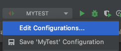
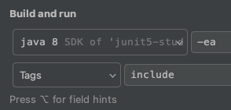
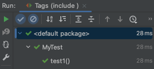
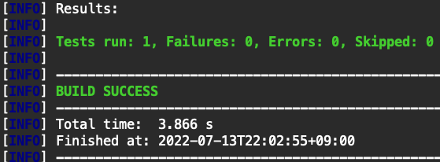

# 태깅과 필터링
JUnit5의 태깅과 필터링 기능에 대해 알아본다.

테스트 메소드에 어노테이션으로 태그를 추가하여 그룹화하면, 해당 그룹의 메소드들만 필터링하여 실행할 수 있게 해주는 기능이다.

## @Tag 어노테이션
- 특정 테스트 메소드에 선언 후 이름을 넣어주고 특정 설정만 넣어주면, 그 이름에 해당하는 메소드들만 그룹화하여 실행시킨다.
	- IDE에서 실행: IDE에서 설정
	- Build tool로 실행: build tool의 설정 파일에서 설정 

## 예시 
include 태그는 실행시키려는 메소드, exclude 태그는 실행에서 배제하려는 메소드임을 나타내었다.

```java
import org.junit.jupiter.api.*;

public class MyTest {
    @Test
    @Tag("include")
    void test1() {
        System.out.println("test1");

    }

    @Test
    @Tag("exclude")
    void test2() {
        System.out.println("test2");
    }
}
```

### IDE (IntelliJ)에서 실행 시
- Edit Configurations... 클릭



- Build and run에서 Tags로 설정 후 태그 이름을 적어준다.



- Run


- 확인



### Build tool로 실행시
#### Maven

빌드 시 특정 profile을 택하면 해당 profile의 설정에 맞게 테스트 해준다.

구조는 다음과 같다.

- pom.xml의 profiles 엘리먼트 안에 profile 엘리먼트를 넣어준다. (profiles 엘리먼트가 없다면 만들어야 한다.)
	- profile 엘리먼트에 대한 설정은 밑에서 설명한다.
- 명령어에서 profile 옵션을 넣어주면, 해당 프로파일에 대한 설정에 맞게 실행
	- 예시
		- `./mvnw test -P local`: local이라는 이름의 프로파일에 대한 설정에 맞게 실행

설정 방법은 다음과 같다.

pom.xml에서 profiles 엘리먼트 안에 다음을 추가한다. (profiles 태그가 없다면 추가한다.)

```xml
<profile>
    <id>설정하고 싶은 profile 이름</id>
    <build>
        <plugins>
            <plugin>
                <artifactId>maven-surefire-plugin</artifactId>
                <configuration>
                    <groups>테스트 메소드에 선언한 태그 이름</groups>
                </configuration>
            </plugin>
        </plugins>
    </build>
</profile>
```

만약 profile의 id값을 local로 설정하였고, groups를 include로 설정했다고 가정하고 테스트해보면 태깅된 메소드만 실행되는 것을 확인할 수 있다.

`./mvnw test -P local`



##### 팁

- profile 엘리먼트 안에 다음과 같이 설정해주면 명령어에서 profile 옵션을 넣어주지 않아도 (`./mvnw test`) 해당 설정이 적용된다.

```xml
<activation>
    <activeByDefault>true</activeByDefault>
</activation>
```
 
-  groups 엘리먼트 안에는 2개 이상의 태깅 이름을 설정할 수 있다.
	- 해당 태깅 이름 중 하나에 속한다면 테스트 실행
	
```xml
<group>include | exclude</groups>
```

- maven의 profile과 JUnit5의 옵션에 대한 추가적인 사항이 궁금하다면 공식문서를 참조하면 된다.
	- [https://maven.apache.org/guides/introduction/introduction-to-profiles.html](https://maven.apache.org/guides/introduction/introduction-to-profiles.html)
	- [https://junit.org/junit5/docs/current/user-guide/#running-tests-tag-expressions](https://junit.org/junit5/docs/current/user-guide/#running-tests-tag-expressions)
