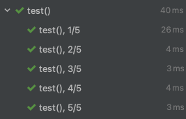
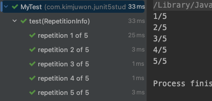
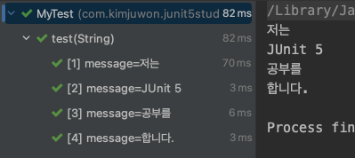
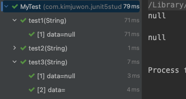

# 테스트 반복하기
테스트 메소드를 반복하는 방법에 대해 알아본다.

## @RepeatedTest

테스트 메소드에 @RepeatedTest를 선언하면 해당 메소드를 반복하여 테스트해준다.

### 속성

`value`: 반복할 횟수

```
import org.junit.jupiter.api.*;

public class MyTest {
    @RepeatedTest(5) // 'value' 표기는 생략 가능
    void test() {
        System.out.println("test");
    }
}
```
	
	
	
`name`

- 각각의 테스트에 대한 이름을 설정
	- {displayName}: 테스트 이름
	- {currentRepetition}: 현재 반복 횟수
	- {totalRepetitions}: 총 반복 횟수
- 기본값: **"repetition {currentRepetition} of {totalRepetitions}"**

```java
import org.junit.jupiter.api.*;

public class MyTest {
    @RepeatedTest(value = 5, name = "{displayName}, {currentRepetition}/{totalRepetitions}")
    void test() {
        System.out.println("test");
    }
}
```


### RepetitionInfo 파라미터
@Repeted 어노테이션 적용 시, 해당 메소드에 RepetitionInfo 타입의 파라미터를 사용할 수 있다.

- getCurrentRepetition(): 현재 반복 횟수를 가져옴
- getTotalRepetitions(): 총 반복 횟수를 가져옴

```java
import org.junit.jupiter.api.*;

public class MyTest {
    @RepeatedTest(5)
    void test(RepetitionInfo repetitionInfo) {
        System.out.println(repetitionInfo.getCurrentRepetition() +
                "/" + repetitionInfo.getTotalRepetitions());
    }
}
```



## @ParameterizedTest
반복되는 테스트마다 다른 값을 가지고 테스트하고 싶을때 사용하는 어노테이션이다.

값을 넘겨주는 어노테이션과 같이 사용된다.

### 값을 넘겨주는 어노테이션
종류는 다음과 같다.

1. @ValueSource
2. @NullSource, @EmptySource, @NullAndEmptySource
3. @EnumSource
4. @MethodSource
5. @CvsSource
6. @CvsFileSource
7. @ArgumentSource

이번 문서에서는 1, 2, 5만 알아본다. 나머지는 공식 문서 참조.

#### @ValueSource
- 특정 타입을 정하고, 해당하는 값을 나열하여 넣어준다.
- 값은 파라미터로 매핑할 수 있다.

```java
import org.junit.jupiter.params.ParameterizedTest;
import org.junit.jupiter.params.provider.ValueSource;

public class MyTest {
    @ParameterizedTest
    @ValueSource(strings = {"저는", "JUnit 5", "공부를", "합니다."})
    void test(String message) {
        System.out.println(message);
    }
}
``` 



- @ValueSource 어노테이션을 까보면 적용할 수 있는 타입들이 나타나있다.

```java
...
...
public @interface ValueSource {
    short[] shorts() default {};

    byte[] bytes() default {};

    int[] ints() default {};

    long[] longs() default {};

    float[] floats() default {};

    double[] doubles() default {};

    char[] chars() default {};

    boolean[] booleans() default {};

    String[] strings() default {};

    Class<?>[] classes() default {};
}
```

#### @NullSource, @EmptySource, @NullAndEmptySource
`@NullSource`

- null 값을 제공한다.

`@EmptySource`

- 빈 값("")을 제공한다.

`@NullAndEmptySource`

- null 값과 빈 값을 제공한다. (테스트 총 2번 실행)

```java
import org.junit.jupiter.params.ParameterizedTest;
import org.junit.jupiter.params.provider.*;

public class MyTest {
    @ParameterizedTest
    @NullSource
    void test1(String data) {
        System.out.println(data);
    }

    @ParameterizedTest
    @EmptySource
    void test2(String data) {
        System.out.println(data);
    }

    @ParameterizedTest
    @NullAndEmptySource
    void test3(String data) {
        System.out.println(data);
    }
}
```

