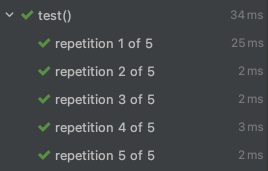

# 테스트 반복하기
테스트 메소드를 반복하는 방법에 대해 알아본다.

## @RepeatedTest

테스트 메소드에 @RepeatedTest를 선언하면 해당 메소드를 반복하여 테스트해준다.

### 속성

`value`: 반복할 횟수

```java
import org.junit.jupiter.api.*;

public class MyTest {
    @RepeatedTest(5) // 'value' 표기는 생략 가능
    void test() {
        System.out.println("test");
    }
}
```
	
	
	
`name`

- 각각의 테스트에 대한 이름을 설정
	- {displayName}: 테스트 이름
	- {currentRepetition}: 현재 반복 횟수
	- {totalRepetitions}: 총 반복 횟수
- 기본값: **"repetition {currentRepetition} of {totalRepetitions}"**

```java
import org.junit.jupiter.api.*;

public class MyTest {
    @RepeatedTest(value = 5, name = "{displayName}, {currentRepetition}/{totalRepetitions}")
    void test() {
        System.out.println("test");
    }
}
```


### RepetitionInfo 파라미터
@Repeted 어노테이션 적용 시, 해당 메소드에 RepetitionInfo 타입의 파라미터를 사용할 수 있다.

- getCurrentRepetition(): 현재 반복 횟수를 가져옴
- getTotalRepetitions(): 총 반복 횟수를 가져옴

```java
import org.junit.jupiter.api.*;

public class MyTest {
    @RepeatedTest(5)
    void test(RepetitionInfo repetitionInfo) {
        System.out.println(repetitionInfo.getCurrentRepetition() +
                "/" + repetitionInfo.getTotalRepetitions());
    }
}
```


## @ParameterizedTest
반복되는 테스트마다 다른 값을 가지고 테스트하고 싶을때 사용하는 어노테이션이다.

인자를 넘겨주는 어노테이션과 같이 사용된다.

### 인자를 넘겨주는 어노테이션
종류는 다음과 같다.

1. @ValueSource
2. @NullSource, @EmptySource, @NullAndEmptySource
3. @EnumSource
4. @MethodSource
5. @CsvSource
6. @CvsFileSource
7. @ArgumentSource

#### @ValueSource
- 특정 타입을 정하고, 해당하는 값을 나열하여 넣어준다.
- 값은 파라미터로 매핑할 수 있다.

```java
import org.junit.jupiter.params.ParameterizedTest;
import org.junit.jupiter.params.provider.ValueSource;

public class MyTest {
    @ParameterizedTest
    @ValueSource(strings = {"저는", "JUnit 5", "공부를", "합니다."})
    void test(String message) {
        System.out.println(message);
    }
}
``` 


- @ValueSource 어노테이션을 까보면 적용할 수 있는 타입들이 나타나있다.

```java
...
...
public @interface ValueSource {
    short[] shorts() default {};

    byte[] bytes() default {};

    int[] ints() default {};

    long[] longs() default {};

    float[] floats() default {};

    double[] doubles() default {};

    char[] chars() default {};

    boolean[] booleans() default {};

    String[] strings() default {};

    Class<?>[] classes() default {};
}
```

#### @NullSource, @EmptySource, @NullAndEmptySource
`@NullSource`

- null 값을 제공한다.

`@EmptySource`

- 빈 값("")을 제공한다.

`@NullAndEmptySource`

- null 값과 빈 값을 제공한다. (테스트 총 2번 실행)

```java
import org.junit.jupiter.params.ParameterizedTest;
import org.junit.jupiter.params.provider.*;

public class MyTest {
    @ParameterizedTest
    @NullSource
    void test1(String data) {
        System.out.println(data);
    }

    @ParameterizedTest
    @EmptySource
    void test2(String data) {
        System.out.println(data);
    }

    @ParameterizedTest
    @NullAndEmptySource
    void test3(String data) {
        System.out.println(data);
    }
}
```


#### @CsvSource
csv 형식(몇가지 필드를 쉼표로 구분한 텍스트 데이터 형식)의 인자를 제공한다.

```java
import org.junit.jupiter.params.ParameterizedTest;
import org.junit.jupiter.params.provider.CsvSource;

class MyTest {
    @ParameterizedTest
    @CsvSource({"23, 김주원", "25, 김주혁"})
    void test(int age, String name) {
        System.out.println(age);
        System.out.println(name);
    }
}
```

#### 타입 변환
- 기본적으로 암묵적인 타입 변환이 된다.
	- 자세한 내용은 [공식 문서](https://junit.org/junit5/docs/current/user-guide/#writing-tests-parameterized-tests-argument-conversion-implicit) 참조
- 명시적인 타입 변환도 가능하다.
	- SimpleArgumentConverter를 상속받은 구현체를 작성 (org.junit.jupiter.params.converter.SimpleArgumentConverter)
		- 테스트 클래스 안에 inner static class로 작성하거나, 다른 파일에 public class로 작성해야 한다.
			- convert() 메소드 구현
		- 매개변수 타입 왼쪽에 @ConvertWith를 선언해서 적용한다.

```java
public class User {
    private int id;

    User(int id) {
        this.id = id;
    }

    int getAge() {
        return this.id;
    }
} 
```

```java
import org.junit.jupiter.params.ParameterizedTest;
import org.junit.jupiter.params.converter.*;
import org.junit.jupiter.params.provider.ValueSource;

import static org.junit.jupiter.api.Assertions.*;

class MyTest {
    @ParameterizedTest
    @ValueSource(ints = {10, 20, 30})
    void test(@ConvertWith(UserConverter.class) User user) {
        System.out.println(user.getAge());
    }

    static class UserConverter extends SimpleArgumentConverter {
        @Override
        protected Object convert(Object source, Class<?> targetType) throws ArgumentConversionException {
            assertEquals(User.class, targetType, "User type으로만 변환할 수 있습니다.");
            return new User(Integer.parseInt(source.toString()));
        }
    }
}
```

#### 인자 값 조합
- 방금 살펴본 SimpleArgumentConverter 클래스는 한번에 들어오는 인자가 1개일때만 사용할 수 있다.
- 테스트가 한번 실행될 때 인자가 2개 이상 들어오는 경우가 있다.
	- 위에서 소개한 @CsvSource 같은 경우이다.
- 2개 이상의 인자가 한번에 들어올때는 이들을 조합하여 사용하는 방법이 있다.
	- ArgumentsAccessor
	- 커스텀 Accesssor

`ArgumentsAccessor`

- 매개변수로 ArgumentsAccessor를 선언해서 인덱스를 통해 데이터를 불러온다.

```java
import org.junit.jupiter.params.ParameterizedTest;
import org.junit.jupiter.params.aggregator.ArgumentsAccessor;
import org.junit.jupiter.params.provider.CsvSource;

class MyTest {
    @ParameterizedTest
    @CsvSource({"23, 김주원", "25, 김주혁"})
    void test(ArgumentsAccessor argumentsAccessor) {
        // getInteger(index), getString(index)
        User user = new User(argumentsAccessor.getInteger(0), argumentsAccessor.getString(1));

        ...
    }
}
```

`커스텀 Accessor`

- ArgumentsAggregator 인터페이스 구현 (org.junit.jupiter.params.aggregator.ArgumentsAggregator)
	- 테스트 클래스 안에 inner static class로 작성하거나, 다른 파일에 public class로 작성해야 한다.
		- aggregateArguments() 메소드 구현
	- 매개변수 타입 왼쪽에 @AggregateWith을 선언해서 적용한다.

```java
import org.junit.jupiter.api.extension.ParameterContext;
import org.junit.jupiter.params.ParameterizedTest;
import org.junit.jupiter.params.aggregator.*;
import org.junit.jupiter.params.provider.CsvSource;

class MyTest {
    @ParameterizedTest
    @CsvSource({"23, 김주원", "25, 김주혁"})
    void test(@AggregateWith(UserAggregator.class) User user) {
        ...
    }

    static class UserAggregator implements ArgumentsAggregator {
        @Override
        public Object aggregateArguments(ArgumentsAccessor accessor, ParameterContext context) throws ArgumentsAggregationException {
            return new User(accessor.getInteger(0), accessor.getString(1));
        }
    }
}
```
