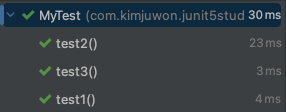

# 테스트 순서
JUnit5 테스트 클래스에 있는 테스트 메소드들이 실행 순서를 정할 수 있는 방법에 대해 알아본다.

## JUnit 5의 테스트 순서
- JUnit 5의 특정 내부 로직에 따라 순서가 정해지는데, 테스트 순서를 명확하게 정해놓지는 않는다.
- 개발자는 테스트 순서를 중요하게 생각할 필요가 없고, 의존해서도 안된다.
	- 테스트 메소드들은 서로 독립적이어야 하기 때문이다. 

## 테스트 순서 설정하기
- 하지만 상황에 따라 테스트 메소드들의 실행 순서를 설정해야한다고 판단되면, 테스트 순서를 설정하는 기능을 쓸 수 있다.

### 클래스에 @TestMethodOrder 선언
- 테스트 클래스에 @TestMethodOrder 선언을 하고 각 테스트 메소드별로 순서를 부여할 수 있다.
- 메소드별로 각각의 인스턴스가 생성되는 경우(PER.METHOD)와 클래스 당 하나의 인스턴스만 생성되는 경우(PER.CLASS) 전부에 적용 가능

1. 테스트 클래스에 @TestMethodOrder 선언
	- value 속성으로 MethodOrderer의 구현체를 넣음
		- 구현체 종류
			- OrderAnnotation
			- Alphanumeric
			- Ramdom
		- 이 문서에서는 OrderAnnotation에 대해서만 알아본다.
2. 테스트 메소드에 @Order 선언
	- @Value 속성으로 우선순위 값(int)를 넣어줌
		- 값이 작을수록 먼저 실행됨

#### 예시
```java
import org.junit.jupiter.api.*;

@TestMethodOrder(MethodOrderer.OrderAnnotation.class)
public class MyTest {
    @Test
    @Order(3)
    void test1() {
        System.out.println("test1");
    }

    @Test
    @Order(1)
    void test2() {
        System.out.println("test2");
    }

    @Test
    @Order(2)
    void test3() {
        System.out.println("test3");
    }
}
```

