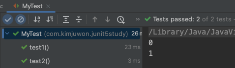
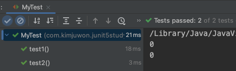

# 테스트 인스턴스
Junit 5의 테스트 클래스의 인스턴스 생성 전략을 알아본다.

## JUnit의 인스턴스 생성 전략
- JUnit은 기본적으로 테스트 클래스마다 하나의 인스턴스를 생성하는게 아니라, 해당 클래스의 테스트 메소드마다 다른 인스턴스를 부여한다.

```java
import org.junit.jupiter.api.*;

public class MyTest {
    @Test
    void test1() {
        System.out.println(this); // com.kimjuwon.junit5study.MyTest@5204062d
    }

    @Test
    void test2() {
        System.out.println(this); // com.kimjuwon.junit5study.MyTest@aecb35a
    }
}
```

## 테스트 클래스당 하나의 인스턴스만 생성하려면
- 클래스 상단에 `@TestInstance(TestInstance.Lifecycle.PER_METHOD)` 를 선언한다.
	- @TestInstance는 org.junit.jupiter.api에 정의되어 있다.

```java
import org.junit.jupiter.api.*;

@TestInstance(TestInstance.Lifecycle.PER_CLASS) // MyTest 테스트 클래스는 인스턴스를 하나만 생성하여 메소드를 호출
public class MyTest {
    @Test
    void test1() {
        ...
    }

    @Test
    void test2() {
        ...
    }
}
```


## 왜 JUnit은 기본적으로 메소드별로 인스턴스를 부여할까?
- 테스트 메소드간의 의존성을 없애기 위해서이다.
- 만약 클래스의 테스트 메소드들이 하나의 인스턴스에서 호출되면, 인스턴스 내 자원의 공유가 발생한다.
	- 불안정해지고 독립적인 테스트를 할 수 없게 된다.

### 예시

- 하나의 인스턴스만 생성하여 메소드를 호출하면
	- value 필드가 공유되기 때문에 테스트 메소드별로 값이 다르게 출력된다. 

```
@TestInstance(TestInstance.Lifecycle.PER_CLASS)
public class MyTest {
    int value = 0;

    @Test
    void test1() {
        System.out.println(value++); 
    }

    @Test
    void test2() {
        System.out.println(value++); 
    }
}
```



- 메소드별로 인스턴스를 생성하여 메소드를 호출하면
	- value 필드는 메소드 별로 가지고 있기 때문에 다른 메소드로부터 변경에 영향을 받지 않는다.

```java
import org.junit.jupiter.api.*;

public class MyTest {
    int value = 0;

    @Test
    void test1() {
        System.out.println(value++);
    }

    @Test
    void test2() {
        System.out.println(value++);
    }
}
```



## BeforeAll, AfterAll 메소드의 static 여부
- @BeforeAll과 @AfterAll이 적용되는 메소드가 static이어야 하는지에 대한 여부
	- 메소드별로 인스턴스가 생성되는 경우 (JUnit의 기본전략): 반드시 static 이어야 한다.
	- 하나의 인스턴스만 생성되는 경우: static이어도 되고 아니어도 된다.